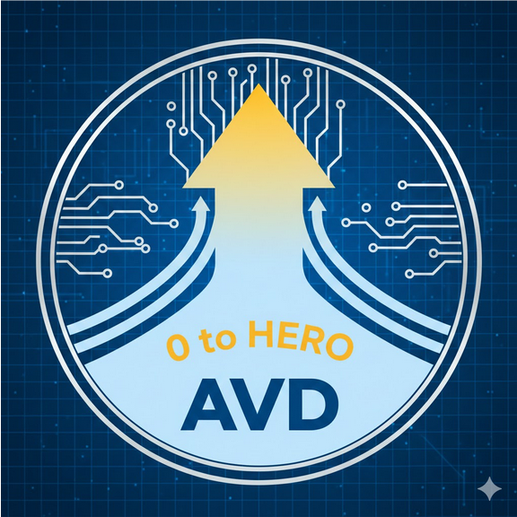
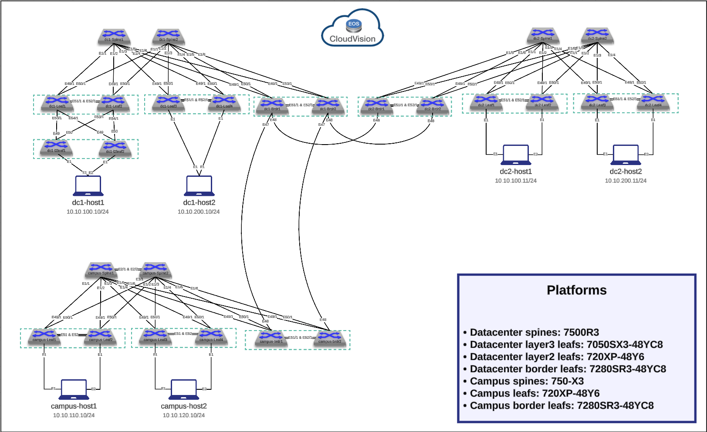

# 0 to Hero AVD

## Introduction

This repository is meant to be used as a reference for the "0 to hero" video series.

The series will focus on using Arista [AVD](https://avd.arista.com) to automate a network deployment from scratch using a NetDevOps approach.  It is targeted at network engineers that want to learn about working with Arista AVD.

It is suggested to have fundamental understanding of Git, Ansible, YAML and VScode but it is not mandatory.

The topology will be composed of two datacenters using EVPN/VXLAN and one campus using L2LS.

We will use AVD with Arista [CloudVision Portal](https://www.arista.com/en/products/eos/eos-cloudvision).  It is also possible to set AVD to provision devices directly by using the `eos_config_deploy_eapi` role in the deploy playbook instead of `cv_deploy` that will be used in this project.

## Episodes guides

[Episode 1 - AVD preprations]([./docs/Episode1/Episode1.md](https://github.com/philippebureau/philippebureau.github.io/blob/main/docs/Episode1/Episode1.md))

- Topology review
- Repo creation
- Basic ansible file/directory structure
- Ansible.cfg file
- Global_vars file
- AVD universal container
- Build playbook
- Deploy playbook
- CloudVision access

[Episode 2 - Basic config](./docs/Episode2/Episode3.md)

- Basic EOS configuration
- Makefile

[Episode 3 - Digital Twin](./docs/Episode8/Episode2.md)

- Configure AVD digital twin feature
- Build playbook update for digital twin
- Deploy playbook for digital twin

[Episode 4 - Underlay](./docs/Episode3/Episode4.md)

- Build the underlays
- Testing playbook

[Episode 5 - Overlay](./docs/Episode4/Episode5.md)

- Build the overlay / Network services
  - Tenants
  - Svi
  - l2vlan

[Episode 6 - Endpoint connectivity](./docs/Episode5/Episode6.md)

- Connected Endpoints
- Network ports

[Episode 7 - WAN / DCI](./docs/Episode6/Episode7.md)

- DCI
- Campus Inter-connect
- EVPN Gateway

[Episode 8 - Pipelines](./docs/Episode7/Episode8.md)

- Feature branch auto build and testing
- Create CVP Change Control on merge to the main branch
