# Episode 1 - AVD preparations

- [Episode 1 - AVD preparations](#episode-1---avd-preparations)
  - [Basic repository structure](#basic-repository-structure)
    - [Git](#git)
    - [Sites file structure](#sites-file-structure)
    - [Ansible](#ansible)
      - [Ansible configuration file](#ansible-configuration-file)
      - [Ansible inventory](#ansible-inventory)
    - [Ansible execution environment](#ansible-execution-environment)
      - [Ansible playbooks](#ansible-playbooks)
    - [CloudVision Authentication](#cloudvision-authentication)
  - [Conclusion and house keeping](#conclusion-and-house-keeping)

In this Episode we will set up the repository with the basic file structure and ansible playbooks to run AVD as well as define a Devcontainer

## Basic repository structure

### Git

We will be using GitHub for this project but any Git platform would work.

You can find detailed instructions on how to create a GitHub repository on the [GitHub documentation](https://docs.github.com/en/repositories/creating-and-managing-repositories/quickstart-for-repositories).

> [!Note]
> It is highly recommended for users that will follow these steps to set a private repository to avoid any sensitive data being exposed publicly.

1. Create a repository, we will use `0_to_hero_AVD` for this example

    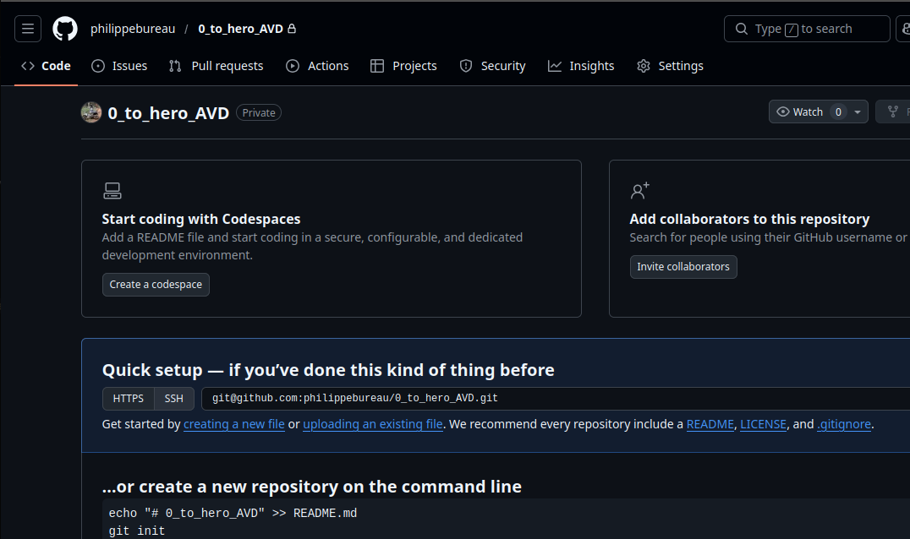

2. Clone the repository on your system and open it in your IDE

    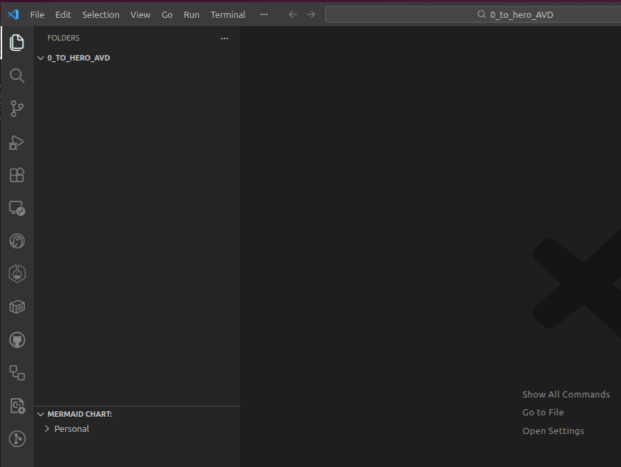

### Sites file structure

AVD can be configured to managed multiple locations as a single AVD fabric or multiple AVD fabrics. The decision depends on organizational preferences.  For this example, we will set each datacenter and campus as its own independent AVD fabric.

1. Create a directory at the root of your repository, we will use `sites` in this repository and create `DC1`, `DC2`, `campus` sub-directories to match our topology.

    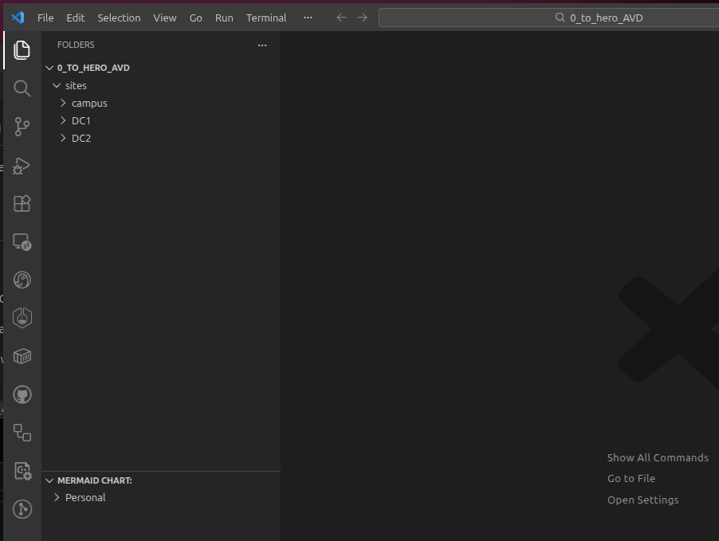

### Ansible

We will use the [arista.avd](https://galaxy.ansible.com/ui/repo/published/arista/avd/) ansible collection to build our network.  Ansible will provide `inventory management`, `variable allocation` and `orchestration` for our AVD project.

#### Ansible configuration file

The first item we need to set is the Ansible configuration file to instruct Ansible on how it should behave

1. Create a file called `ansible.cfg` at the root of the repository

2. Add the AVD recommended values

    > See AVD recommendations for [ansible.cfg](https://avd.arista.com/6.0/docs/installation/collection-installation.html#ansible-configuration-file) file.

    ```ini
    [default]
    # AVD recommended values
    duplicate_dict_key=error
    ```

    We recommend to "error out" on duplicate keys, the default Ansible behavior is to issue a warning in the playbook output.

    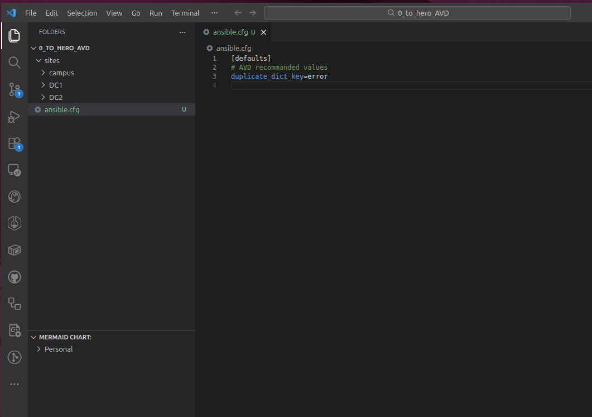

3. Add AVD global_vars plugin settings (optional)

    AVD global vars are a way to set AVD variables that will apply to multiple AVD fabrics for common configuration.  This will be useful in our repositories because we have elected to use multiple AVD fabrics.

    Global vars can be set to look for a file or a directory.

    In our example repository, we want to use a directory called `_global_vars`

    First let's create the new directory under the `sites` directory

    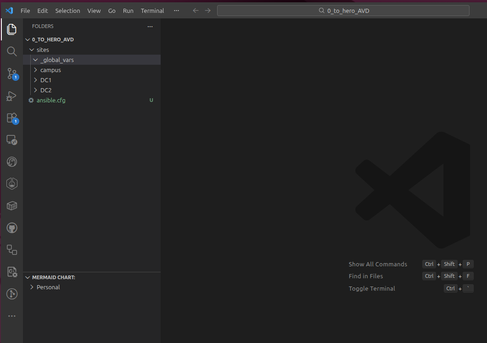

    Next we need to add the global vars settings in the ansible.cfg

    Under the [default] section enable avd global_vars plugin.

    ```ini
    # enable AVD global vars plugin
    vars_plugins_enabled = arista.avd.global_vars, host_group_vars
    ```

    Create a [vars_global_vars] section and set the `path` to the new directory.

    ```ini
    [vars_global_vars]
    paths = ../_global_vars/
    ```

    > See the AVD documentation for more details on <a href="https://avd.arista.com/6.0/docs/plugins/Vars_plugins/global_vars.html?h=global_vars#global_vars" target="_blank">global_vars</a>

    <details>
      <summary>Expand for the full ansible.cfg content</summary>

    ```ini
    [defaults]
    # AVD recommended values
    duplicate_dict_key=error
    # enable AVD global vars plugin
    vars_plugins_enabled = arista.avd.global_vars, host_group_vars

    [vars_global_vars]
    paths = ../_global_vars/
    ```

    </details>

#### Ansible inventory

Ansible provides the inventory management for AVD. We have to create an Ansible inventory file to define AVD managed devices. Ansible inventory allows us to create groups that will help with assigning configuration later.

Every inventory is different and should adapt to how common configurations are assigned.

Let's create a `inventory.yml` per site with a group structure that makes sense for our topology

In that inventory we need to tell Ansible how to access all EOS devices. It is important to have a group that contains all the EOS devices and ONLY the EOS devices that AVD will manage, in our example that group will be called after the site name (`DC1`, `DC2` and `CAMPUS`).

DC1 inventory:

```yaml
all:
  children:
    DC1:
      children:
        SPINES:
          hosts:
            dc1-spine1:
              ansible_host: 192.168.0.10
            dc1-spine2:
              ansible_host: 192.168.0.11
        L3LEAFS:
          hosts:
            dc1-leaf1:
              ansible_host: 192.168.0.12
            dc1-leaf2:
              ansible_host: 192.168.0.13
            dc1-leaf3:
              ansible_host: 192.168.0.14
            dc1-leaf4:
              ansible_host: 192.168.0.15
            dc1-brdr1:
              ansible_host: 192.168.0.100
            dc1-brdr2:
              ansible_host: 192.168.0.101
        L2LEAFS:
          hosts:
            dc1-l2leaf1:
              ansible_host: 192.168.0.16
            dc1-l2leaf2:
              ansible_host: 192.168.0.17


```

DC2 inventory:

```yaml
all:
  children:
    DC2:
      children:
        SPINES:
          hosts:
            dc2-spine1:
              ansible_host: 192.168.0.20
            dc2-spine2:
              ansible_host: 192.168.0.21
        L3LEAFS:
          hosts:
            dc2-leaf1:
              ansible_host: 192.168.0.22
            dc2-leaf2:
              ansible_host: 192.168.0.23
            dc2-leaf3:
              ansible_host: 192.168.0.24
            dc2-leaf4:
              ansible_host: 192.168.0.25
            dc2-brdr1:
              ansible_host: 192.168.0.200
            dc2-brdr2:
              ansible_host: 192.168.0.201
```

Campus inventory:

```yaml
all:
  children:
    CAMPUS:
      children:
        SPINES:
          hosts:
            campus-spine1:
              ansible_host: 192.168.0.30
            campus-spine2:
              ansible_host: 192.168.0.31
        LEAFS:
          children:
            POD1:
              hosts:
                campus-leaf1:
                  ansible_host: 192.168.0.32
                campus-leaf2:
                  ansible_host: 192.168.0.33
            POD2:
              hosts:
                campus-leaf3:
                  ansible_host: 192.168.0.34
                campus-leaf4:
                  ansible_host: 192.168.0.35
            BORDER_POD:
              hosts:
                campus-brdr1:
                  ansible_host: 192.168.0.36
                campus-brdr2:
                  ansible_host: 192.168.0.37

```

Below is an example of the current inventory structure.

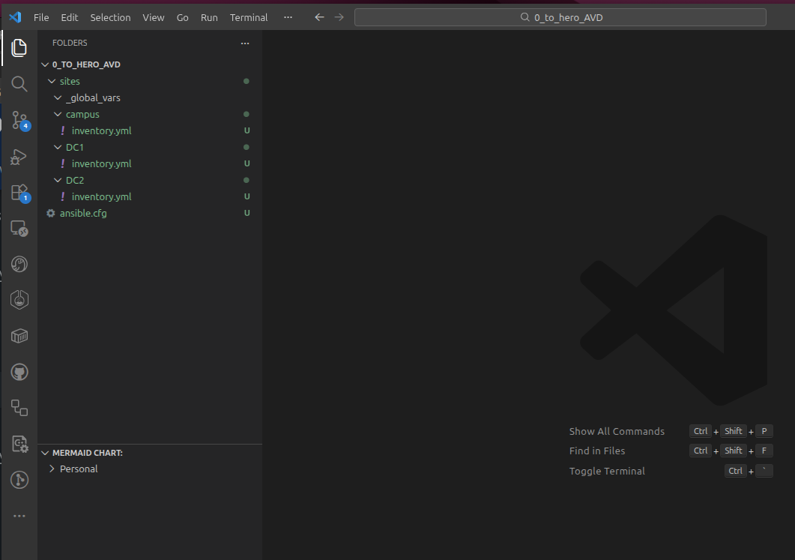

> [!Note]
> See more details on [Ansible inventory](https://docs.ansible.com/projects/ansible/devel/inventory_guide/intro_inventory.html)

### Ansible execution environment

Ansible runs on Linux only.  AVD has specific version requirements for Python, Python libraries and Ansible.

> [!Note]
> See [AVD installation instructions](https://avd.arista.com/6.0/docs/installation/collection-installation.html)

For ease of use, Arista AVD provides a pre-built container that has all the requirements pre-installed and makes AVD easy to use and upgrade.

We will use this container for this example but feel free to use your preferred method.

> [!Note]
> Requirements to use the AVD container
>
>- install a container manager (ex: Podman, Docker...)
>- install VScode (or other IDE) DevContainer extension

1. Create a directory called `.devcontainer` and a file called `devcontainer.json` in that directory

2. Set the `devcontainer.json` file with the image target the AVD version you want to run.  In this example AVD 6.0.0 with python 3.13

    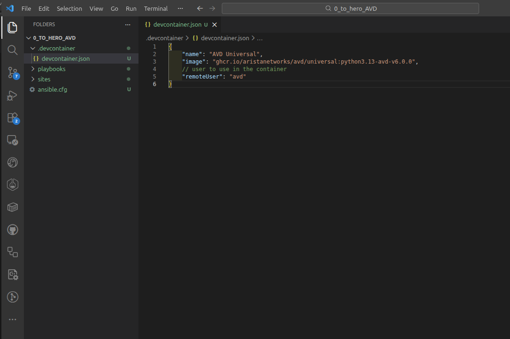

    devcontainer.json:

    ```json
    {
        "name": "AVD Universal",
        "image": "ghcr.io/aristanetworks/avd/universal:python3.13-avd-v6.0.0",
        // user to use in the container
        "remoteUser": "avd"
    }
    ```

3. Use VScode command palette to `Rebuild and Reopen in Container`

    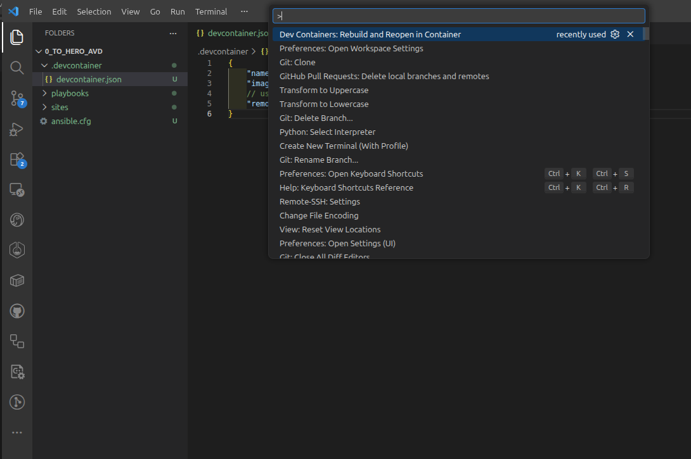

We now have a working AVD environment.

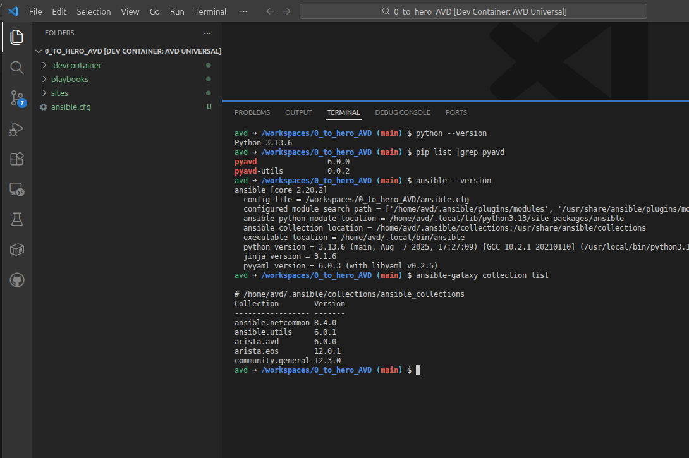

> [!Note]
> See more details on using [AVD containers](https://avd.arista.com/6.0/docs/containers/overview.html)


#### Ansible playbooks

Ansible will be used to run AVD.  AVD has a build phase and a deploy phase so we will create two playbooks to reflect that.

It is fairly typical to create a directory to store all the playbooks.  Let's create a `playbooks` directory and two files called `build.yml` and `deploy.yml`

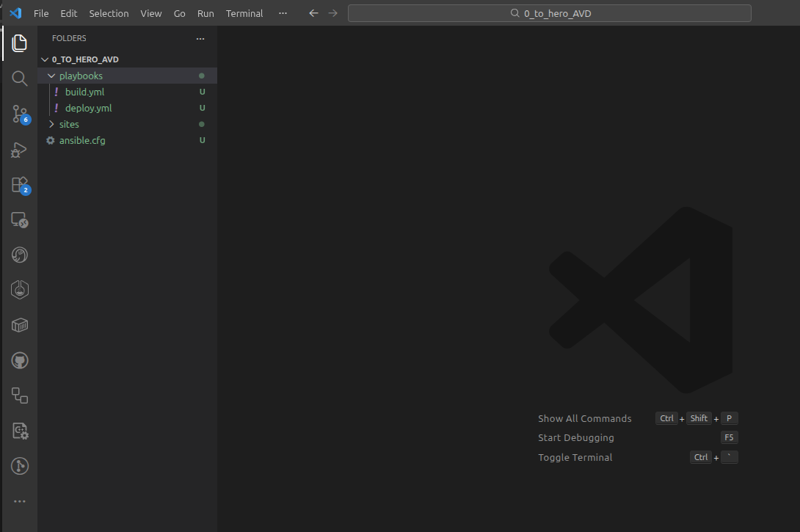

The build playbook will run AVD build phase that renders the documentation and the EOS devices configuration.  It will run two roles in the ansible.avd collection called `eos_designs` and `eos_cli_config_gen`

Since we have three AVD fabrics and we want to avoid creating playbooks for each of them, we will use inline Jinja for the `hosts` key and we will pass the value for this variable at the cli using `extra-vars`

build.yml:

```yaml
---
- name: Build Switch configuration
  hosts: "{{ target }}"
  connection: local
  gather_facts: false

  tasks:
    - name: generate intended variables
      import_role:
        name: arista.avd.eos_designs
    - name: generate device intended config and documentation
      import_role:
        name: arista.avd.eos_cli_config_gen

```

For the deploy playbook, we will run the `cv_deploy` role that provision EOS devices through CloudVision.  We will use the role input variables to target the CloudVision server, a CVaaS instance in this example.

We will also set the configlet name prefix and add the `cv_token` key that is required to authenticate with CloudVision.  We will get back to set the value in a step later.  It is also possible to define your CVP server in the inventory and point to that in the cv_deploy role.

deploy.yml:

```yaml
---
- name: Configuration deployment with CVP
  hosts: "{{ target }}"
  gather_facts: false
  #ansible vault file
  vars_files: ../vault.yml
  tasks:
    - name: Deploy configurations and tags to CloudVision
      ansible.builtin.import_role:
        name: arista.avd.cv_deploy
      vars:
        cv_server: www.cv-prod-na-northeast1-b.arista.io
        cv_configlet_name_template: "AVD-${hostname}"
        cv_token: "{{ vault_cv_token }}"
```

> See more details on [cv_deploy inputs](https://avd.arista.com/6.0/ansible_collections/arista/avd/roles/cv_deploy/index.html#inputs)

> See more details on [AVD playbooks](https://avd.arista.com/6.0/ansible_collections/arista/avd/examples/single-dc-l3ls/index.html#the-playbooks)

> See more details on Ansible playbook [syntax](https://docs.ansible.com/projects/ansible/latest/playbook_guide/playbooks_intro.html#playbook-syntax)


### CloudVision Authentication

CloudVision Portal requires a service account token to use APIs.  Create a token and take note of it.

> [!Warning]
> The token is sensitive and should not be set in plain text in the repository.  For this example we will use Ansible Vault to encrypt the token content.
> See instructions on how to add a [service account token](https://avd.arista.com/6.0/ansible_collections/arista/avd/roles/cv_deploy/index.html#inputs).

1. Create a YAML file that will be encrypted later.  We will use `vault.yml` in this example and create a key with the token as the key value.  We will use `vault_cv_token` in this example

    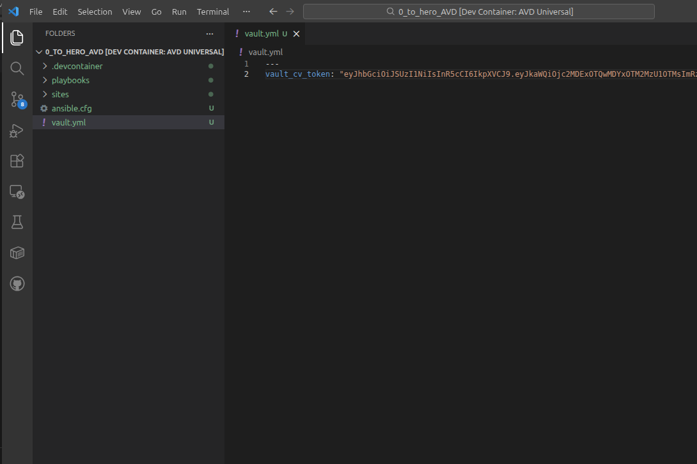

2. Encrypt the vault file with the `ansible-vault` command as follow `ansible-vault encrypt vault.yml`

    > The `ansible-vault` command requires a working ansible environment

    You will be asked to create a vault password.  Take note of the password you configured.  After the command execution, the file is now encrypted.

    > Make sure not to git commit the vault.yml file before encrypting it otherwise the clear text content would be available through git commit history.

    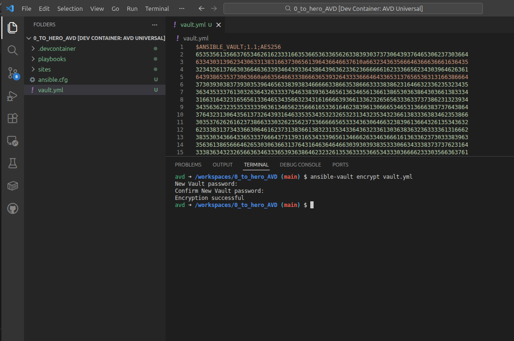

3. Set the `cv_token` variable value in the `deploy.yml` playbook with the key we created in the vault.yml file using inline Jinja.

    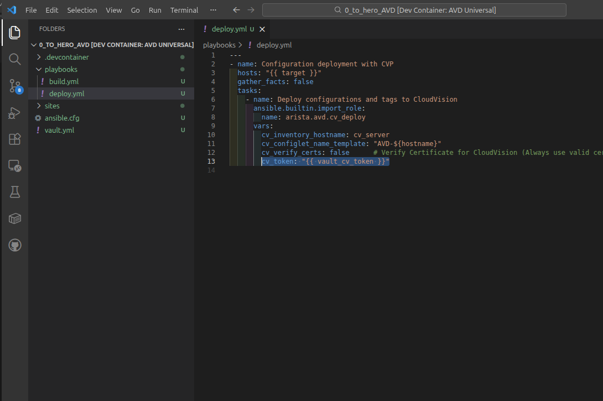

4. We have to make the content of the `vault.yml` file available to the deploy playbook at runtime.  We will use the `vars_file` variable in the play that runs the AVD cv_deploy role.

    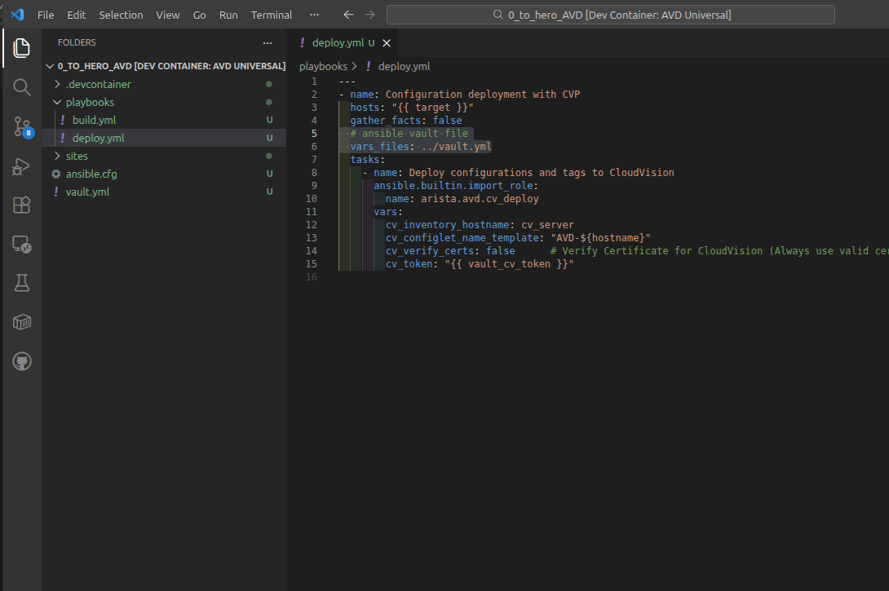

<details>
  <summary>Expand for the full deploy.yml content</summary>

```yaml
---
- name: Configuration deployment with CVP
  hosts: "{{ target }}"
  gather_facts: false
  # ansible vault file
  vars_files: ../vault.yml
  tasks:
    - name: Deploy configurations and tags to CloudVision
      ansible.builtin.import_role:
        name: arista.avd.cv_deploy
      vars:
        cv_inventory_hostname: cv_server
        cv_configlet_name_template: "AVD-${hostname}"
        cv_verify_certs: false      # Verify Certificate for CloudVision (Always use valid certificates for production)
        cv_token: "{{ vault_cv_token }}"

```

</details>

## Conclusion and house keeping

Congratulations! We now have a working AVD environment and basic file structure to start working on our basic EOS configurations in [Episode 2](../Episode2/Episode2.md).

It is now time to commit what we have to Git and sync with the remote repository.

> [!Note]
> Make sure you have set your git `user.name` and `user.email`

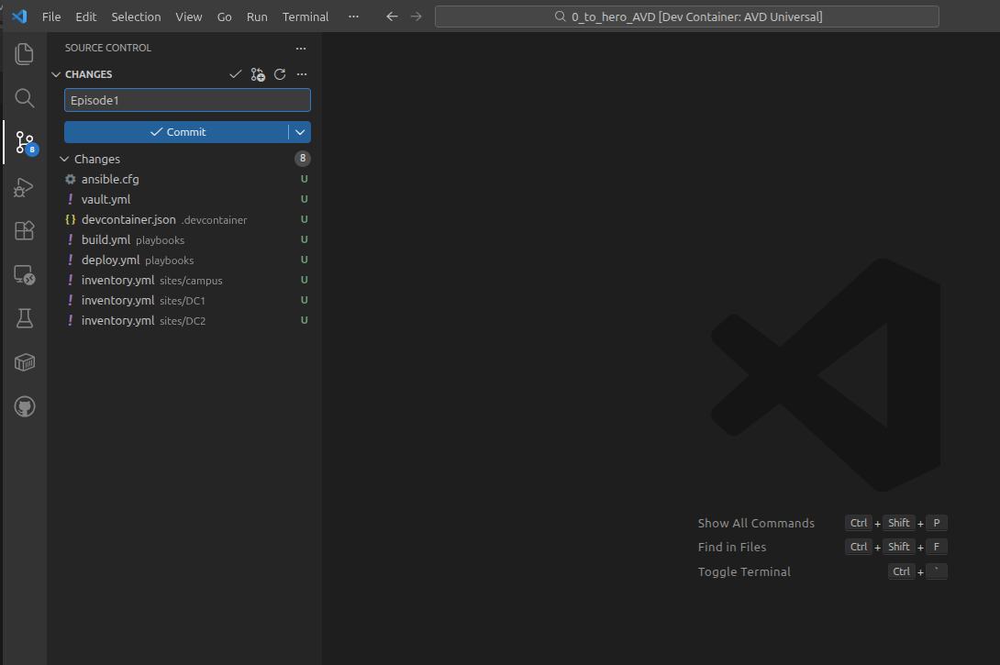
