# Episode 2 - Basic EOS configurations

- [Episode 2 - Basic EOS configurations](#episode-2---basic-eos-configurations)
  - [Basic configuration](#basic-configuration)
    - [Global Vars](#global-vars)
      - [Common management configurations](#common-management-configurations)
    - [Fabric numbering](#fabric-numbering)
    - [Fabric topology](#fabric-topology)
    - [CloudVision Tags](#cloudvision-tags)
    - [DC1 and DC2 fabric topology and CloudVision tags](#dc1-and-dc2-fabric-topology-and-cloudvision-tags)
    - [Node type settings](#node-type-settings)
      - [Campus](#campus)
        - [platform](#platform)
        - [management IPs](#management-ips)
        - [Pools](#pools)
        - [Build](#build)
      - [DCs](#dcs)
        - [spines](#spines)
        - [VTEPs](#vteps)
        - [Layer 2 LEAFs in DC1](#layer-2-leafs-in-dc1)
        - [Build](#build-1)
  - [Conclusion and house keeping](#conclusion-and-house-keeping)

## Basic configuration

We first need to set the basic management configurations for our network, such as local users, NTP, DNS, aaa, management IP...

Some of these configurations will be shared (ex: NTP) and some not (ex: management IP)

This will allow management access to the EOS devices.  We will work on the fabric underlay/overlays in upcoming episodes.

### Global Vars

The common configurations will be set under the global variables.  As we explained in Episode 1, the configurations set under global vars are assigned to **ALL** AVD fabrics.

#### Common management configurations

First, let's create a new file to set the basic shared management configuration, I will use `management.yml` in this example.

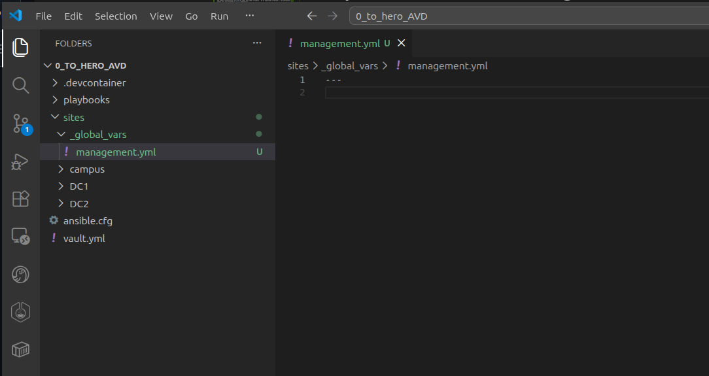

To find the AVD data-model inputs we want to use in the file, we will go to the [AVD documentation](https://avd.arista.com/6.1/ansible_collections/arista/avd/roles/eos_designs/docs/data-models.html#management-settings) site under the `Management settings` section of AVD Designs.

> [!Note]
> you can use the search function to find the specific data-model you are looking for.
> 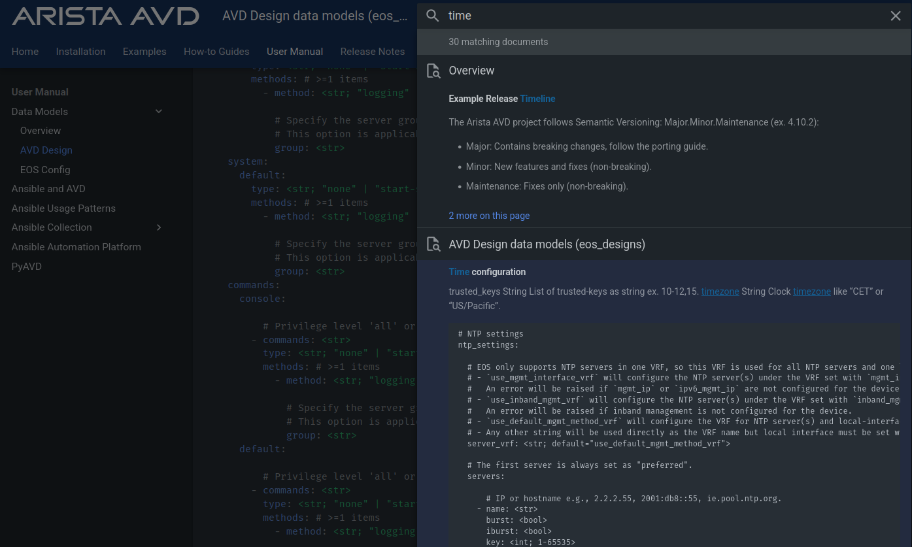

Let's start with the local user.

From the `aaa_settings` data-model we will take what we need.

```yaml
#define local users
aaa_settings:
  local_users:
    - name: cvpadmin
      privilege: 15
      role: network-admin
      sha512_password: "$6$vQGQxmJp16IINuqk$makfRsxIS8Das8bugela5cdUd0iSUzA0/nPRXWXmonGeQ/vuqWi.vrr1OINH4MZLCOux0tniArjvyJNJHe9Zt."
```

> [!Tip]
> Move the password value to the vault.yml file to reduce the hashed password exposure.

Let's do a similar exercise with `aaa authorization exec`, `eAPI`, `CloudVision settings`, `DNS`, `NTP`, `timezone`, `sFlow` and `banner`

```yaml
---
#define local users
aaa_settings:
  authorization:
    exec:
      default: local

# enable eAPIs
management_eapi:
  enabled: true
  enable_https: true

# Streaming agent configuration
cv_settings:
  cvaas:
    enabled: true
    clusters:
      - name: cvaas
        region: na-northeast1-b
  terminattr:
    disable_aaa: true

# DNS settings
DNS_settings:
  domain: demo.lab
  servers:
    - ip_address: 8.8.8.8
      vrf: default
    - ip_address: 8.8.4.4
      vrf: default
  set_source_interfaces: false

# NTP Servers
NTP_settings:
  server_vrf: default
  servers:
    - name: 0.north-america.pool.NTP.org
    - name: 1.north-america.pool.NTP.org

# Timezone
timezone: EST

# Sflow
fabric_sflow:
  uplinks: True
  downlinks: True
  endpoints: True
  l3_edge: True
  core_interfaces: True
  mlag_interfaces: True
  l3_interfaces: True
sflow_settings:
  polling_interval: 50
  sample:
    rate: 10
  destinations:
    - destination: 127.0.0.1
      vrf: default
  vrfs:
    - name: default
      source_interface: Loopback0

# Banner
custom_structured_configuration_banners:
  motd: |
    0 to Hero network
    EOF
```

<details>
  <summary>Expand for the full management.yml content</summary>

```yaml
---
#define local users
aaa_settings:
  local_users:
    - name: cvpadmin
      privilege: 15
      role: network-admin
      sha512_password: "$6$vQGQxmJp16IINuqk$makfRsxIS8Das8bugela5cdUd0iSUzA0/nPRXWXmonGeQ/vuqWi.vrr1OINH4MZLCOux0tniArjvyJNJHe9Zt."
  authorization:
    exec:
      default: local

# enable eAPIs
management_eapi:
  enabled: true
  enable_https: true

# Streaming agent configuration
cv_settings:
  cvaas:
    enabled: true
    clusters:
      - name: cvaas
        region: na-northeast1-b
  terminattr:
    disable_aaa: true

# DNS settings
DNS_settings:
  domain: demo.lab
  servers:
    - ip_address: 8.8.8.8
      vrf: default
    - ip_address: 8.8.4.4
      vrf: default
  set_source_interfaces: false

# NTP Servers
NTP_settings:
  server_vrf: default
  servers:
    - name: 0.north-america.pool.NTP.org
    - name: 1.north-america.pool.NTP.org

# Timezone
timezone: EST

# Sflow
fabric_sflow:
  uplinks: True
  downlinks: True
  endpoints: True
  l3_edge: True
  core_interfaces: True
  mlag_interfaces: True
  l3_interfaces: True
sflow_settings:
  polling_interval: 50
  sample:
    rate: 10
  destinations:
    - destination: 127.0.0.1
      vrf: default
  vrfs:
    - name: default
      source_interface: Loopback0

# Banner
custom_structured_configuration_banners:
  motd: |
    0 to Hero network
    EOF

```

</details>

### Fabric numbering

AVD relies on node IDs to assign IPs from pools such as for Loopbacks and uplinks.  The node IDs can be assigned manually or by AVD.  For this example we will let AVD assign the node IDs.  We need to turn on [pool manager](https://avd.arista.com/6.1/ansible_collections/arista/avd/roles/eos_designs/docs/data-models.html?h=pool+manager#details-on-pool_manager-for-node-ids) as it is not enabled by default

First, let's create a new file under `_global_vars` specific for fabric settings.  I'll call it `fabric_settings.yml` in this example.  And lets add the proper data-model inputs.

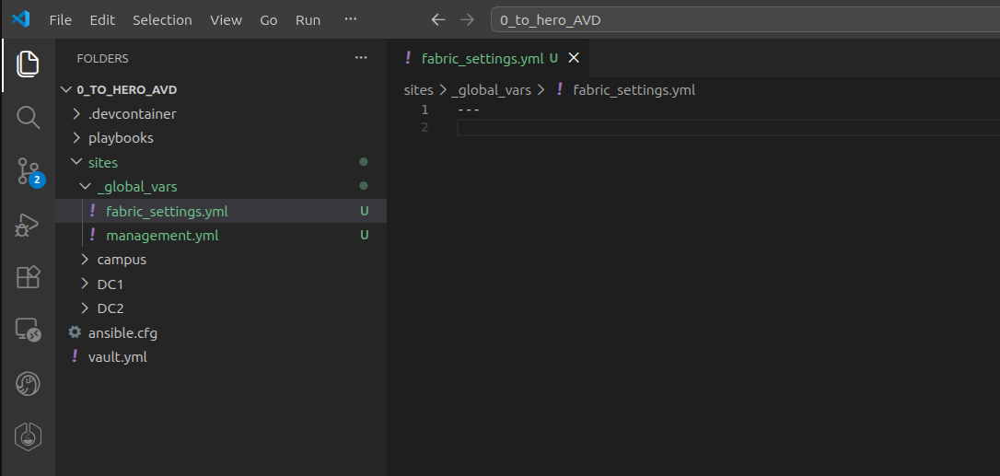

```yaml
# enable node id manager
fabric_numbering:
  node_id:
    algorithm: pool_manager
```

While we are here, AVD would assign unique IPs for MLAG peer-link (L2 and L3) as default behavior.  I prefer to re-use the same IPs across all devices to save IPs since these IPs will not be redistributed in the underlay and overlays.

In the same file, let's add the `mlag` portion of the [fabric_numbering](https://avd.arista.com/6.1/ansible_collections/arista/avd/roles/eos_designs/docs/data-models.html?h=pool+manager#fabric-ip-addressing) data-model.

```yaml
# Reuse same IP for mlag L2 and L3 peering
fabric_ip_addressing:
  mlag:
    algorithm: same_subnet
```

<details>
  <summary>Expand for the full fabric_settings.yml content</summary>

```yaml
---
# enable node id manager
fabric_numbering:
  node_id:
    algorithm: pool_manager

# Reuse same IP for mlag L2 and L3 peering
fabric_ip_addressing:
  mlag:
    algorithm: same_subnet
```

</details>

### Fabric topology

AVD requires us to define a structured logical fabric topology.  It will be used in multiple aspects of AVD rendering.

AVD has three hierarchical layers of topology as follow, and only `fabric_name` is required

```text
├── fabric_name
│   └── dc_name
│       └── pod_name
```

> [!NOTE]
> See [Fabric topology](https://avd.arista.com/6.1/ansible_collections/arista/avd/roles/eos_designs/docs/data-models.html?h=pool+manager#fabric-topology-hierarchy) for more details

This needs to be unique per fabric so we will set the proper file structure in each site.

Let's start with campus.  We will create a new directory called `group_vars` under `sites/campus/`.  The directory name is fixed as per Ansible syntax variable manager.

Let's create a file called `CAMPUS.yml` under `sites/campus/group_vars`

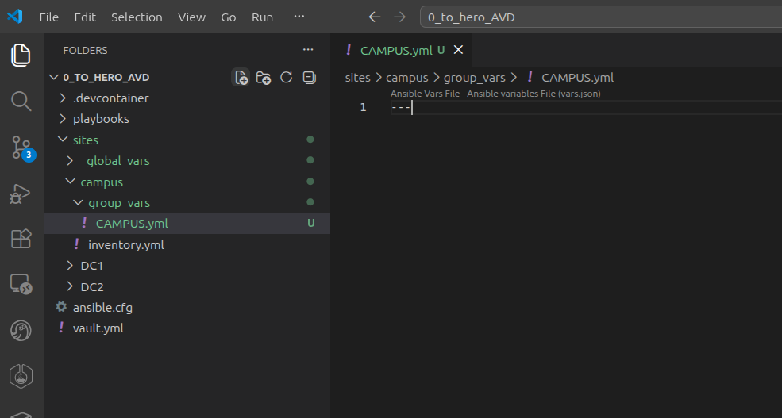

> [!IMPORTANT]
> The file name **MUST** match (case sensitive) groups defined in the `inventory.yml` file for configurations to apply to devices that are assigned to the Ansible group.

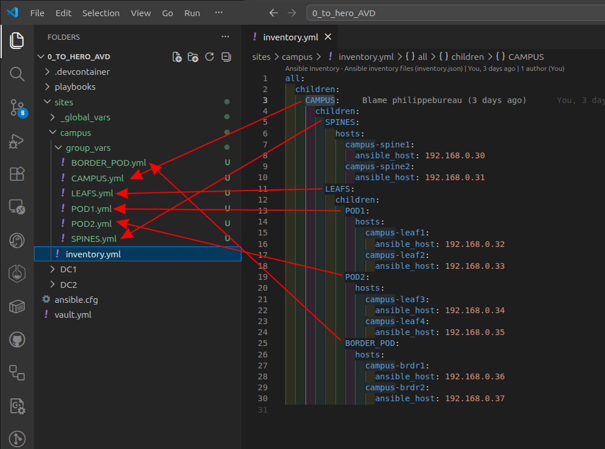

Let's set the fabric topology as per this diagram.

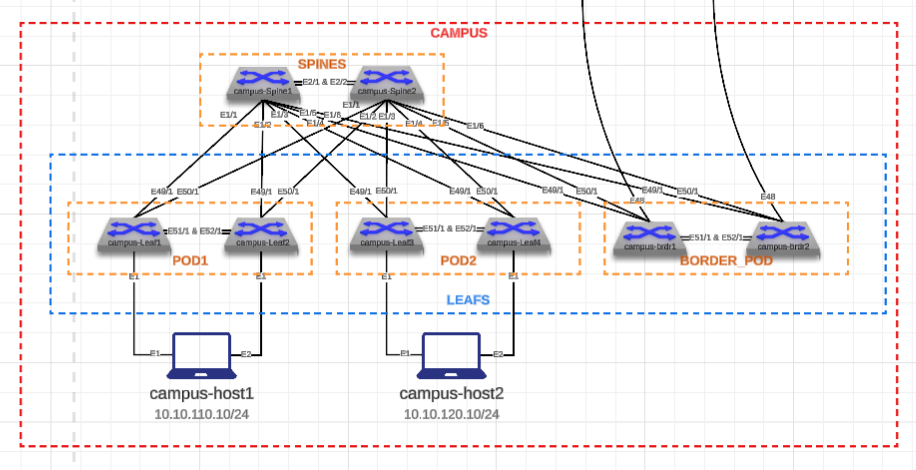

The top level fabric topology tier `fabric_name` **MUST** match the inventory group that includes **ALL** EOS devices in `inventory.yml`

CAMPUS.yml

```yaml
---
#Fabric name
fabric_name: CAMPUS
```

Next we will set the POD information.  We again have to match the inventory group name for file names under group_vars.

Let's create `POD1.yml`, `POD2.yml` and `BORDER_POD.yml` and set the `pod_name` values

POD1.yml

```yaml
---
# Fabric POD
pod_name: POD1
```

POD2.yml

```yaml
---
# Fabric POD
pod_name: POD2
```

BORDER_POD.yml

```yaml
---
# Fabric POD
pod_name: BORDER_POD
```

### CloudVision Tags

AVD can generate CloudVision Tags that will help CloudVision to generate the proper topology and also some integration with studios quick actions for the campus.

>[!Note]
> See more details on AVD [CloudVision tag settings](https://avd.arista.com/6.1/ansible_collections/arista/avd/roles/eos_designs/docs/data-models.html?h=pool+manager#cloudvision-tags-settings)

We will add to the relevant inputs in `sites/campus/groups_vars/CAMPUS.yml` first.  This applies to all campus devices

CAMPUS.yml

```yaml
#generate CVP tags
generate_cv_tags:
  topology_hints: true
  # campus tags for quick actions
  campus_fabric: true

campus: CAMPUS
```

Next we have to set pod specific configuration

POD1.yml

```yaml
# CloudVision tags
campus_pod: POD1
campus_access_pod: CAMPUS-ACCESS-POD1
```

POD2.yml

```yaml
# CloudVision tags
campus_pod: POD2
campus_access_pod: CAMPUS-ACCESS-POD2
```

<details>
  <summary>Expand for the full files content</summary>

CAMPUS.yml

```yaml
---
#Fabric name
fabric_name: CAMPUS

#generate CVP tags
generate_cv_tags:
  topology_hints: true
  # campus tags for quick actions
  campus_fabric: true

campus: CAMPUS

```

POD1.yml

```yaml
---
# Fabric POD
pod_name: POD1

# CloudVision tags
campus_pod: POD1
campus_access_pod: CAMPUS-ACCESS-POD1

```

POD2.yml

```yaml
---
# Fabric POD
pod_name: POD2

# CloudVision tags
campus_pod: POD2
campus_access_pod: CAMPUS-ACCESS-POD2

```

BORDER_POD.yml

```yaml
---
# Fabric POD
pod_name: BORDER_POD

# CloudVision tags
campus_pod: BORDER_POD
campus_access_pod: CAMPUS-BORDER-POD

```

</details>

### DC1 and DC2 fabric topology and CloudVision tags

We have to do the same thing with DC1 and DC2 but we do not require the campus specific tag configuration

To avoid copy pasting the CloudVision Tags to each DC, we can set the bellow inputs in `sites/_global_vars/fabric_settings.yml`

```yaml
#generate CVP tags
generate_cv_tags:
  topology_hints: true
```

> [!Note]
> Ansible will find the same root key `generate_cv_tags` in `sites/campus/CAMPUS.yml` and overwrite what was assigned in `_global_vars/fabric_settings` as group_vars takes precedence over global_vars.

Then we have to set the `fabric_name` and `dc_name` for the DCs.  We will not define pods for now.

<details>
  <summary>Expand for the files content</summary>

sites/DC1/group_vars/DC1.yml

```yaml
---
#Fabric name
fabric_name: DC1

# DC variable
dc_name: DC1

```

sites/DC2/group_vars/DC2.yml

```yaml
---
#Fabric name
fabric_name: DC2

# DC variable
dc_name: DC2

```

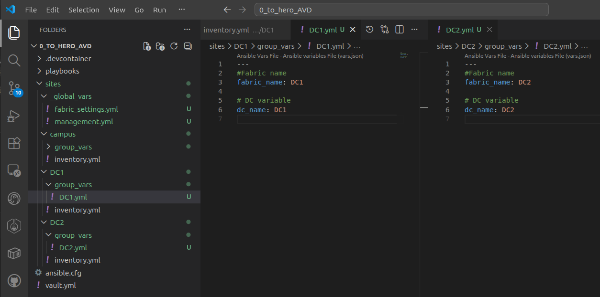

</details>

### Node type settings

AVD must be told what `node type` each EOS devices will be to properly render the configuration and documentation.  This is done using the [Node type variables](https://avd.arista.com/6.1/ansible_collections/arista/avd/roles/eos_designs/docs/data-models.html?h=pool+manager#node-type-variables).

AVD has pre-defined node types to fit many popular designs
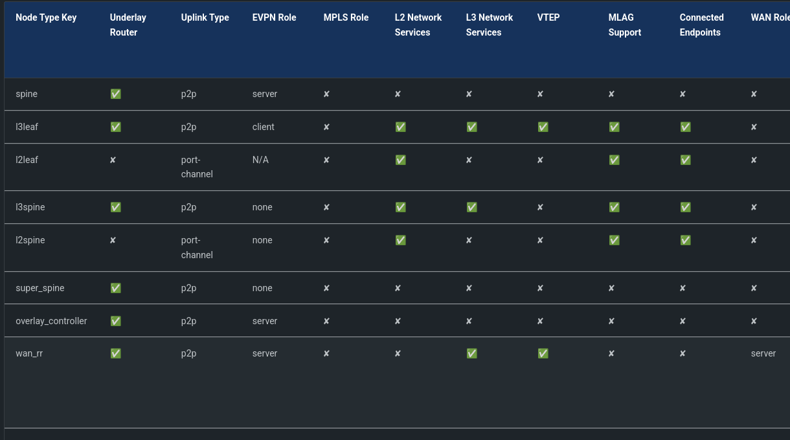 with the support of [Custom Node Types](https://avd.arista.com/6.1/ansible_collections/arista/avd/roles/eos_designs/docs/data-models.html?h=pool+manager#node-type-customization) to support any type of designs.

#### Campus

We will build the campus as a L2LS (Layer2 Leaf-Spine) network.  In this design, the spines are the devices that handles underlay routing, does not participate in EVPN, supports L2 and L3 services, is not a VTEP and runs MLAG.  Based on that, we will use the `l3spine` based on the above feature table.  We will use `l2leaf` for the leafs based on the same table and the required features.

Let's begin with the spines.  We will create a file called `SPINES` under `sites/campus/group_vars`

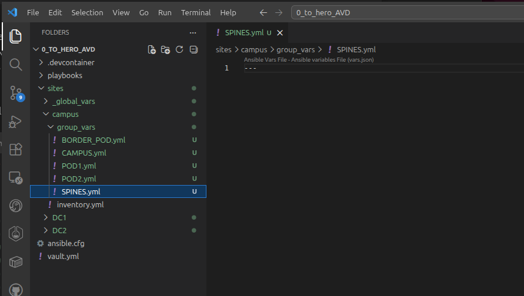

Add the `type` key and assign the correct value.

```yaml
---
# Spine Switches

type: l3spine

```

> [!TIP]
> the node type can be automatically derived by AVD from the hostname using [default node types](https://avd.arista.com/6.1/ansible_collections/arista/avd/roles/eos_designs/docs/data-models.html#default-node-types-settings)

Next, we need to define the `l3spine` node type configuration from the [node type settings](https://avd.arista.com/6.1/ansible_collections/arista/avd/roles/eos_designs/docs/data-models.html#node-type-settings)

Node type settings have a hierarchical structure with 3 precedence level

```text
├── node type
│   |── defaults
│   |── node_groups
│   |   └── nodes
|   └── nodes

```

All node types have the same structure based on defaults, node_group, node_group.node, node and all variables can be defined in any section and support inheritance like this:

```text
defaults <- node_group <- node_group.node <- node
```

Let's set that data-model in the `SPINES.yml` file and define the nodes in a node group called `SPINES`

```yaml
l3spine:
  defaults:
  node_groups:
    - group: SPINES
      nodes:
        - name: campus-spine1
        - name: campus-spine2

```

> [!NOTE]
> the `name` key under `nodes` or `node_groups.nodes` **MUST** match the Ansible inventory host name.  And **ALL** hosts defined in the Ansible inventory must have a `type` assigned otherwise AVD execution will error out.

> [!NOTE]
> If you set 2 nodes in a node_group and the node type has the `mlag support` feature enabled, AVD will automatically configure them in an MLAG pair.  If you define more than 2 nodes in a node group, AVD will not configure MLAG

##### platform

AVD can derive many platform specific configurations such as the management interface or tcam profiles if we define the `platform` node type setting

> [!NOTE]
> You can find the available default platforms and configurations [here](https://avd.arista.com/6.1/ansible_collections/arista/avd/roles/eos_designs/docs/data-models.html#__code_100_annotation_1)

Since all of our spines are 750-X3 as per our [diagram](/media/diagram.png), we will add the `platform` key under the `default` dictionary.

```yaml
l3spine:
  defaults:
    platform: 755

```

##### management IPs

Next we need to assign a management IP for each spine using the `mgmt_ip` from the [node type common configuration](https://avd.arista.com/6.1/ansible_collections/arista/avd/roles/eos_designs/docs/data-models.html#node-type-common-configuration) data-model.

Let's add `mgmt_ip` under each node in the SPINE group.

```yaml
l3spine:
  node_groups:
    - group: SPINES
      nodes:
        - name: campus-spine1
          mgmt_ip: 192.168.0.30/24
        - name: campus-spine2
          mgmt_ip: 192.168.0.31/24

```

##### Pools

In AVD, the easiest way to assign IPs for interfaces present on all devices such as Loopbacks is to define a pool.  AVD will assign IPs for each node based on the node ID that will be assigned by the pool manager we configured earlier.

1. Loopback

The spines are underlay routers so AVD needs to set loopback.  This will be done using the [Node type Loopback and VTEP configuration](https://avd.arista.com/6.1/ansible_collections/arista/avd/roles/eos_designs/docs/data-models.html#node-type-loopback-and-vtep-configuration)

```yaml
l3spine:
  defaults:
    loopback_ipv4_pool: 10.98.1.128/25
```

2. MLAG

The spines will be set as an MLAG pair,  we will use the [Node type L2 and MLAG configuration](https://avd.arista.com/6.1/ansible_collections/arista/avd/roles/eos_designs/docs/data-models.html#node-type-l2-and-mlag-configuration) to define the IP pool available.  In the fabric numering section we configured AVD to use the same IPs on all nodes for MLAG peering. We will define two /31 pools using `mlag_peer_ipv4_pool` and `mlag_peer_l3_ipv4_pool`.  While we are here, might as well set `mlag_dual_primary_detection`

```yaml
l3spine:
  defaults:
    mlag_peer_ipv4_pool: 10.101.255.0/31
    mlag_peer_l3_ipv4_pool: 10.101.254.0/31
    mlag_dual_primary_detection: true
```

3. Shared MAC for gateways

The spines will use vARP so we need to defined a shared MAC used by the virtual-router.  We will use the `virtual_router_mac_address` key from the [Node type L2 and MLAG configuration](https://avd.arista.com/6.1/ansible_collections/arista/avd/roles/eos_designs/docs/data-models.html#node-type-l2-and-mlag-configuration) data-model and set the value to `00:1c:73:00:00:99` which is a mac address reserved by Arista for this purpose

```yaml
l3spine:
  defaults:
    virtual_router_mac_address: '00:1c:73:00:00:99'
```

This should take care of our campus spines configuration.

<details>
  <summary>Expand for the full SPINE.yml</summary>

```yaml
---
# Spine Switches

type: l3spine

l3spine:
  defaults:
    platform: 755
    loopback_ipv4_pool: 10.98.1.128/25
    mlag_peer_ipv4_pool: 10.101.255.0/31
    mlag_peer_l3_ipv4_pool: 10.101.254.0/31
    mlag_dual_primary_detection: true
    virtual_router_mac_address: '00:1c:73:00:00:99'
  node_groups:
    - group: SPINES
      nodes:
        - name: campus-spine1
          mgmt_ip: 192.168.0.30/24
        - name: campus-spine2
          mgmt_ip: 192.168.0.31/24

```

</details>

Next we need to set the similar configurations for the campus leafs.

The campus leafs are layer 2 leafs and therefore require less configuration.

Let's create a new file called `LEAFS.yml` under `group_vars` that matches the inventory group name for all leafs.

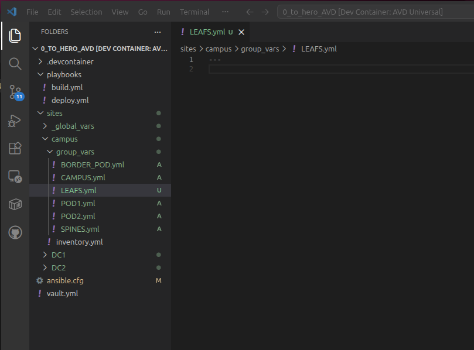

Now, let's set the `type` and the node type structure similar to the spines but only configuring the mlag pool and the management ip for the nodes.  We have to create one node group per pair of leafs in MLAG that we will call `POD1`, `POD2` and `BORDER_POD`

```yaml
---
# L2 Leaf switches

type: l2leaf

l2leaf: # dynamic_key: node_type
  defaults:
    platform: 720XP
    mlag_peer_ipv4_pool: 10.101.255.0/31
    mlag_dual_primary_detection: true

  node_groups:
    - group: POD1
      nodes:
        - name: campus-leaf1
          mgmt_ip: 192.168.0.32/24
        - name: campus-leaf2
          mgmt_ip: 192.168.0.33/24
    - group: POD2
      nodes:
        - name: campus-leaf3
          mgmt_ip: 192.168.0.34/24
        - name: campus-leaf4
          mgmt_ip: 192.168.0.35/24
    - group: BORDER_POD
      platform: 7280R3
      nodes:
        - name: campus-brdr1
          mgmt_ip: 192.168.0.36/24
        - name: campus-brdr2
          mgmt_ip: 192.168.0.37/24
```

##### Build

Now that we have basic management config for the campus, let's go ahead and execute the first run of the build playbook for the campus network.

To run the playbook, we have to execute the `ansible-playbook` command but we also have to specify the campus inventory and use the extra-vars argument to set our `target` variable that will be used in the playbook `hosts` key.

Execute this command in the Terminal

```bash
ansible-playbook playbooks/build.yml -i sites/campus/inventory.yml -e target=CAMPUS
```

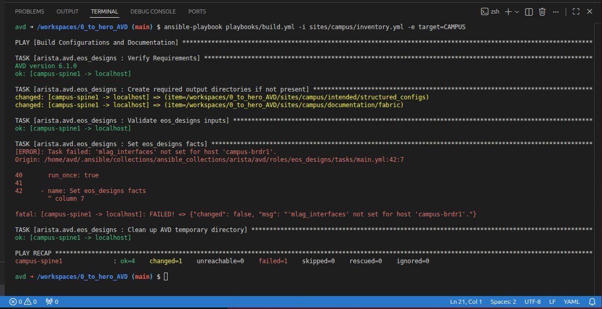

> [!WARNING]
> Oh no! We got an error.  AVD is pretty good at providing feedback when something goes wrong.
>
> In this execution, the error output is:
>
> <code><span style="color:red">[ERROR]: Task failed: 'mlag_interfaces' not set for host 'campus-brdr1'</span></code>
>
> The error indicates we missed the required input for `mlag_interfaces`

A quick [search](https://avd.arista.com/6.1/ansible_collections/arista/avd/roles/eos_designs/docs/data-models.html?h=mlag_interfaces#node-type-l2-and-mlag-configuration) on AVD documentation site takes us to the input details.

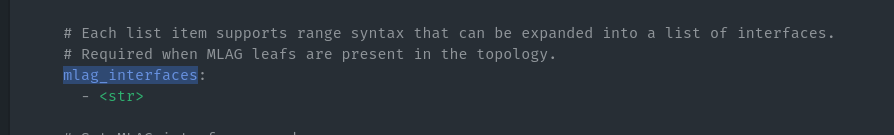

As per the documentation details, `mlag_interfaces` is required when MLAG nodes are present.

The key is in the [Node type L2 and MLAG configuration](https://avd.arista.com/6.1/ansible_collections/arista/avd/roles/eos_designs/docs/data-models.html#node-type-l2-and-mlag-configuration) data-model.

Let's go back to SPINES.yml and LEAFS.yml and add the proper inputs for `mlag_interfaces` under each node type based on the [diagram](/media/diagram.png) data.

To avoid setting the key under each node, since all node of the same type use the same interfaces for MLAG, we will set it under `defaults`.  The border leafs use different interfaces than the rest of the campus leafs so we need to override.

SPINES.yml

```yaml
l3spine:
  defaults:
    mlag_interfaces: [Ethernet2/1, Ethernet2/2]
```

LEAFS.yml

```yaml
l2leaf:
  defaults:
    mlag_interfaces: [Ethernet51, Ethernet52]
  node_groups:
    - group: BORDER_POD
      mlag_interfaces: [Ethernet51/1, Ethernet52/1]
```

<details>
  <summary>Expand for the full file content</summary>

SPINES.yml

```yaml
---
# Spine Switches

type: l3spine

l3spine:
  defaults:
    platform: 755
    loopback_ipv4_pool: 10.98.1.128/25
    mlag_peer_ipv4_pool: 10.101.255.0/31
    mlag_peer_l3_ipv4_pool: 10.101.254.0/31
    mlag_dual_primary_detection: true
    mlag_interfaces: [Ethernet2/1, Ethernet2/2]
    virtual_router_mac_address: '00:1c:73:00:00:99'
  node_groups:
    - group: SPINES
      nodes:
        - name: campus-spine1
          mgmt_ip: 192.168.0.30/24
        - name: campus-spine2
          mgmt_ip: 192.168.0.31/24

```

LEAFS.yml

```yaml
---
# L2 Leaf switches

type: l2leaf

l2leaf:
  defaults:
    platform: 720XP
    mlag_peer_ipv4_pool: 10.101.255.0/31
    mlag_dual_primary_detection: true
    mlag_interfaces: [Ethernet51, Ethernet52]

  node_groups:
    - group: POD1
      nodes:
        - name: campus-leaf1
          mgmt_ip: 192.168.0.32/24
        - name: campus-leaf2
          mgmt_ip: 192.168.0.33/24
    - group: POD2
      nodes:
        - name: campus-leaf3
          mgmt_ip: 192.168.0.34/24
        - name: campus-leaf4
          mgmt_ip: 192.168.0.35/24
    - group: BORDER_POD
      platform: 7280R3
      mlag_interfaces: [Ethernet51/1, Ethernet52/1]
      nodes:
        - name: campus-brdr1
          mgmt_ip: 192.168.0.36/24
        - name: campus-brdr2
          mgmt_ip: 192.168.0.37/24

```

</details>

Let's take a second try at the playbook execution

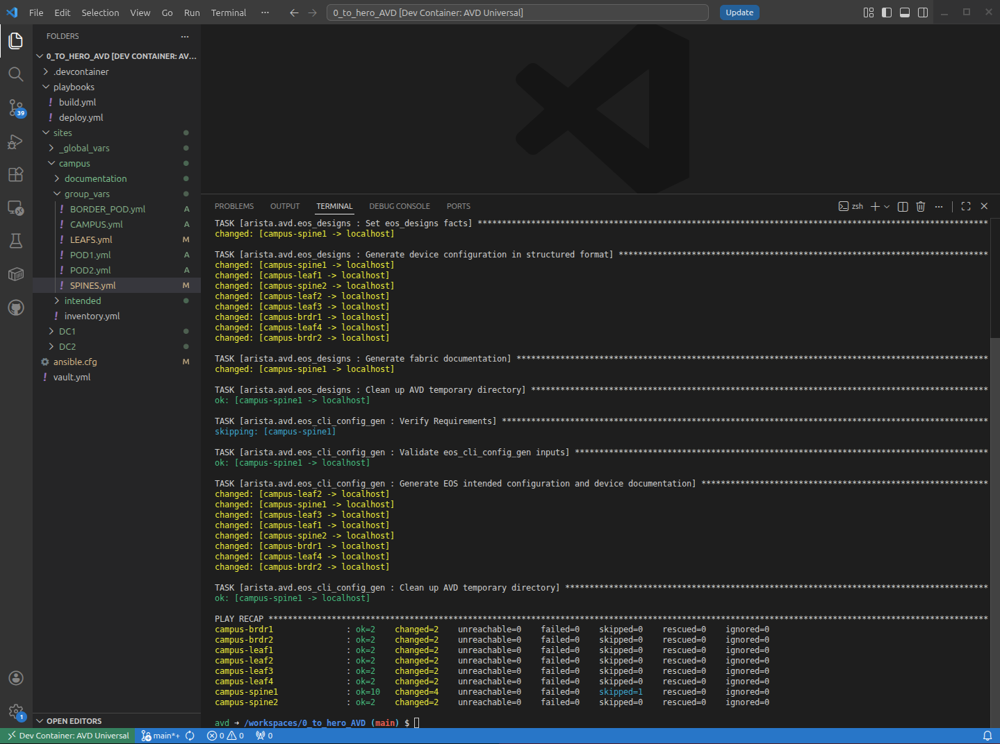

Great, no errors!  Several things just happened, let's take a deeper look.

Two new folders were created by the AVD execution, `documentation` and `intended`.

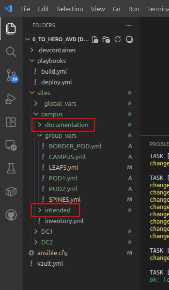

The documentation splits in to other folders, `devices` and `fabric`

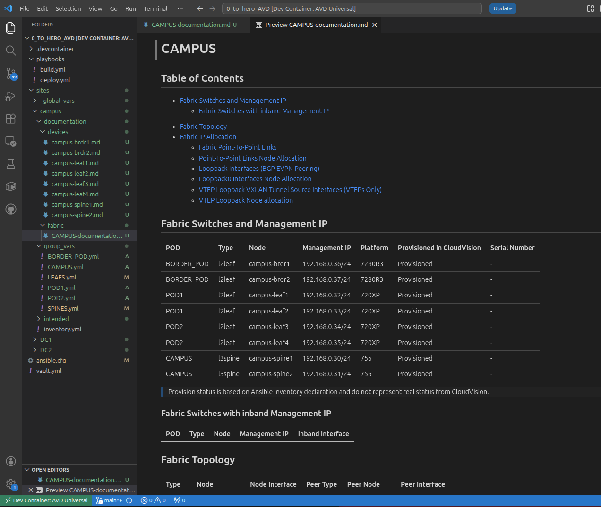

Each sub-folder stores either device specific or fabric wide documentation rendered by AVD.  Feel free to explore those files.

> [!TIP]
> AVD renders documentation in Markdown (.md) format.  Markdown is easy to render for websites.  VScode has a "preview" feature that allows to display the file as it will look on GitHub.
>
> To see the "preview", right click on the file and select `open in preview`
>
> 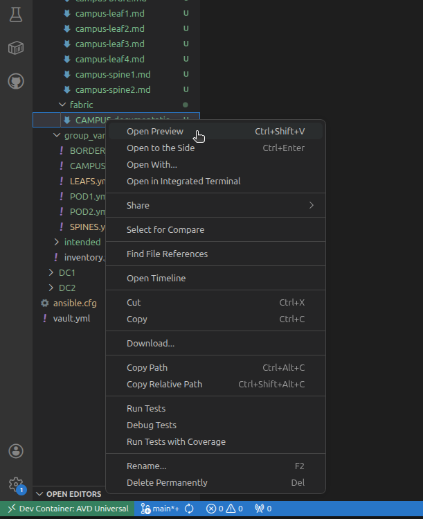

The `intended` folder, contains multiple sub-folders: `configs`, `data` and `structured_configs`.

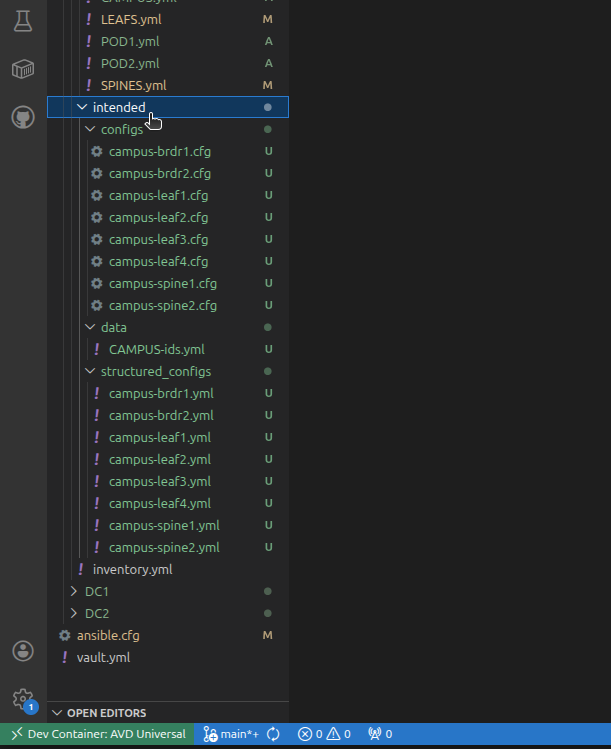

`data` contains the database created by the id manager we configured in the fabric numbering section

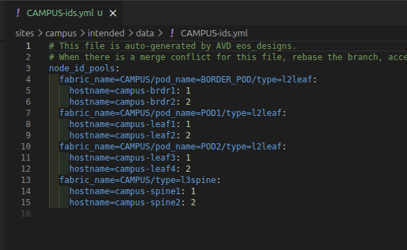

`structured_configs` contains a structured data representation for each devices intended state.

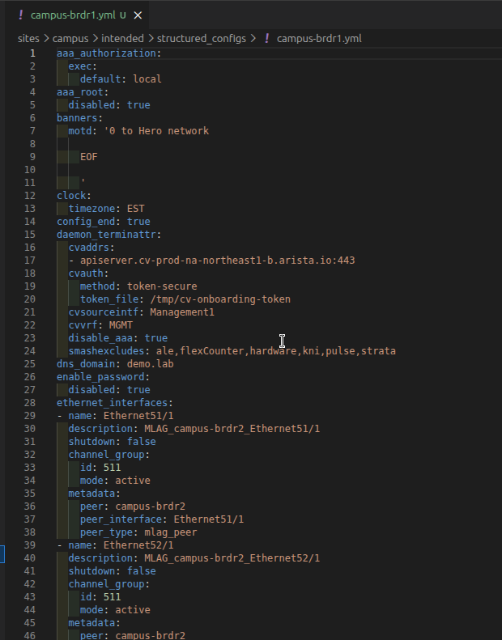

`configs` is where the redered configuration for each devices are stored.

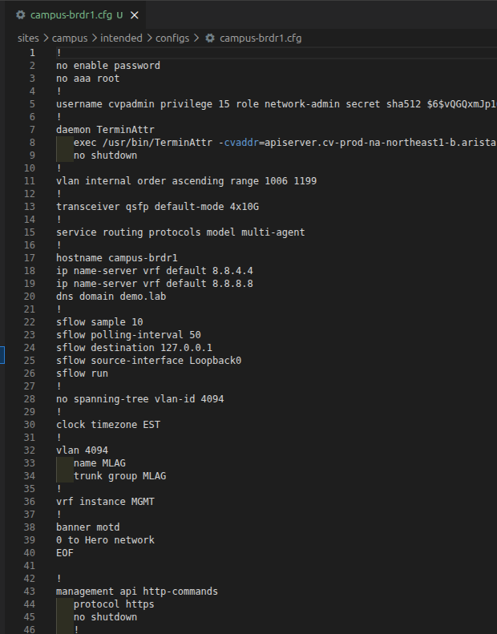

#### DCs

Everything we set in the global vars- [Episode 2 - Basic EOS configurations](#episode-2---basic-eos-configurations) will already apply to the DC fabrics.  What we need to do is define the node type and node type settings.

The DCs will use EVPN/VXLAN.

Let's look back at the default node type feature table to find the type for our design


The correct type for our design are `spine` for the spines, `l3leaf` for the VTEP leafs and `l2leaf` for the sub-leafs.

##### spines

Now that we have some experience with the campus build, we can fill the required files in one pass.  In this design, the spines configuration are simpler than for the campus as they are just underlay router to allow inter-VTEP communications.

The required inputs for this design are loopback and BGP AS since we want to use eBGP for the underlay.

We can find the proper data-model key for BGP under the [node type BGP configuration](https://avd.arista.com/6.1/ansible_collections/arista/avd/roles/eos_designs/docs/data-models.html#node-type-bgp-configuration)

sites/DC1/group_vars/SPINES.yml

```yaml
---
# Spine Switches

type: spine

spine:
  defaults:
    platform: 7500R3
    bgp_as: 65000
    loopback_ipv4_pool: 10.99.1.128/25

  nodes:
    - name: dc1-spine1
      mgmt_ip: 192.168.0.10/24
    - name: dc1-spine2
      mgmt_ip: 192.168.0.11/24

```

sites/DC2/group_vars/SPINES.yml

```yaml
---
# Spine Switches

type: spine

spine:
  defaults:
    platform: 7500R3
    bgp_as: 64000
    loopback_ipv4_pool: 10.99.2.128/25

  nodes:
    - name: dc2-spine1
      mgmt_ip: 192.168.0.20/24
    - name: dc2-spine2
      mgmt_ip: 192.168.0.21/24

```

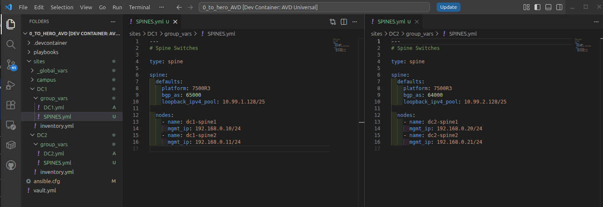

##### VTEPs

The VTEP configurations are a bit more complex since they are the gateway (anycast gateway) and we need to define another loopback for the VXLAN configuration.  We will find the inputs we need under the [node type loopback and vtep configuration](https://avd.arista.com/6.1/ansible_collections/arista/avd/roles/eos_designs/docs/data-models.html#node-type-loopback-and-vtep-configuration) data-model

We will define a pool for the vtep loopback using `loopback_ipv4_pool`.  Since the VTEPs are gateways, we have to set `virtual_router_mac_address`, plus the MLAG settings similar to the campus spines.

We need to create a file called `L3LEAFS.yml` matching the inventory group under each site group_vars.

sites/DC1/group_vars/L3LEAFS.yml

```yaml
# L3 Leaf switches

type: l3leaf

l3leaf:
  defaults:
    platform: 7050X3
    loopback_ipv4_pool: 10.99.1.0/25
    vtep_loopback_ipv4_pool: 10.101.1.0/24
    mlag_peer_ipv4_pool: 10.101.255.0/31
    mlag_peer_l3_ipv4_pool: 10.101.254.0/31
    mlag_dual_primary_detection: true
    mlag_interfaces: [Ethernet51/1, Ethernet52/1]
    virtual_router_mac_address: '00:1c:73:00:00:99'

  node_groups:
    - group: DC1_LEAF1
      bgp_as: 65101
      nodes:
        - name: dc1-leaf1
          mgmt_ip: 192.168.0.12/24
        - name: dc1-leaf2
          mgmt_ip: 192.168.0.13/24
    - group: DC1_LEAF2
      bgp_as: 65102
      nodes:
        - name: dc1-leaf3
          mgmt_ip: 192.168.0.14/24
        - name: dc1-leaf4
          mgmt_ip: 192.168.0.15/24
    - group: DC1_BORDER_LEAF1
      platform: 7280R3
      bgp_as: 65103
      nodes:
        - name: dc1-brdr1
          mgmt_ip: 192.168.0.100/24
        - name: dc1-brdr2
          mgmt_ip: 192.168.0.101/24

```

sites/DC2/group_vars/L3LEAFS.yml

```yaml
---
# L3 Leaf switches

type: l3leaf

l3leaf:
  defaults:
    platform: 7050X3
    bgp_as: 64100
    loopback_ipv4_pool: 10.99.2.0/25
    vtep_loopback_ipv4_pool: 10.102.2.0/24
    mlag_peer_ipv4_pool: 10.102.255.0/31
    mlag_peer_l3_ipv4_pool: 10.102.254.0/31
    mlag_dual_primary_detection: true
    mlag_interfaces: [Ethernet51/1, Ethernet52/1]
    virtual_router_mac_address : '00:1c:73:00:00:99'

  node_groups:
    - group: DC2_LEAF1
      bgp_as: 64101
      nodes:
        - name: dc2-leaf1
          mgmt_ip: 192.168.0.22/24
        - name: dc2-leaf2
          mgmt_ip: 192.168.0.23/24
    - group: DC2_LEAF2
      bgp_as: 64102
      nodes:
        - name: dc2-leaf3
          mgmt_ip: 192.168.0.24/24
        - name: dc2-leaf4
          mgmt_ip: 192.168.0.25/24
    - group: DC2_BORDER_LEAF1
      platform: 7280R3
      bgp_as: 64103
      nodes:
        - name: dc2-brdr1
          mgmt_ip: 192.168.0.200/24
        - name: dc2-brdr2
          mgmt_ip: 192.168.0.201/24
```

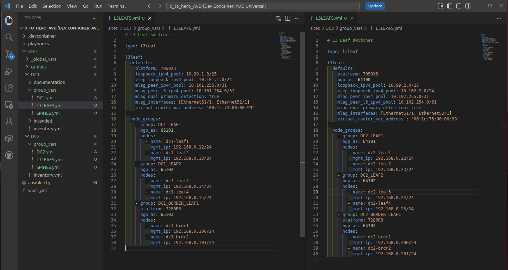

##### Layer 2 LEAFs in DC1

Those leafs will be configured similarly as the campus leafs.  The only inputs will be `platform`, the MLAG config and `mgmt_ip`

```yaml
---
# L2 Leaf switches

type: l2leaf

l2leaf:
  defaults:
    platform: 720XP
    mlag_peer_ipv4_pool: 10.101.255.0/31
    mlag_dual_primary_detection: true
    mlag_interfaces: [Ethernet51, Ethernet52]

  node_groups:
    - group: DC1_L2LEAF12
      nodes:
        - name: dc1-l2leaf1
          mgmt_ip: 192.168.0.16/24
        - name: dc1-l2leaf2
          mgmt_ip: 192.168.0.17/24

```

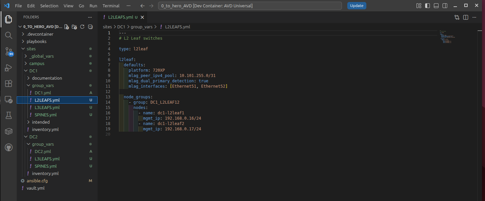

##### Build

Now that the DCs inputs are ready, lets run the build playbook for both DCs

Execute the `ansible-playbook` command with the proper arguments.

DC1

```shell
ansible-playbook playbooks/build.yml -i sites/DC1/inventory.yml -e target=DC1
```

DC2

```shell
ansible-playbook playbooks/build.yml -i sites/DC2/inventory.yml -e target=DC2
```

After execution, each DC will have the `documentation` and `intended`

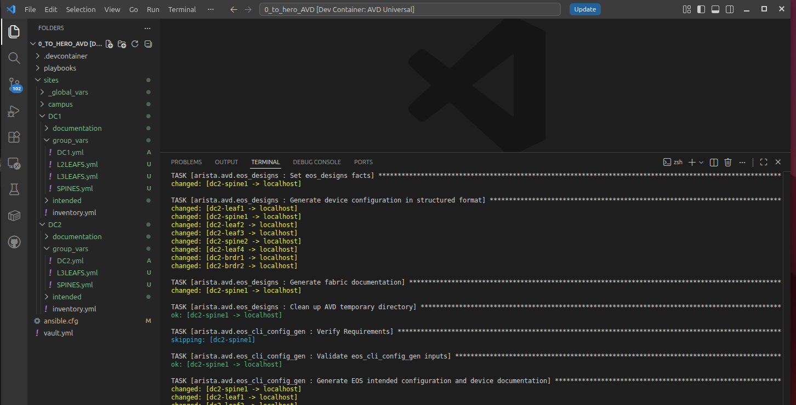

## Conclusion and house keeping

We now have minimalistic configurations for the three sites.  Now seems like a good time to commit our changes and sync to GitHub.

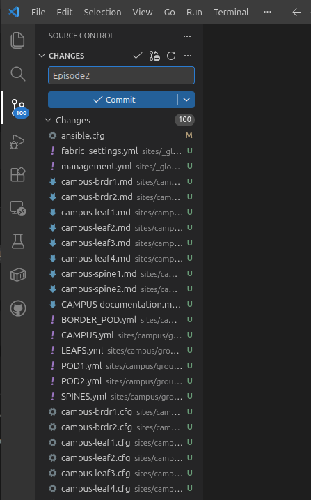

It would be great to be able to push this to the devices and make sure it works.

In [Episode 3](/guide/Episode3/Episode3.md), we will set AVD to create a **digital twin** to test our changes to make sure everything works well before we even plug a singe physical device.
